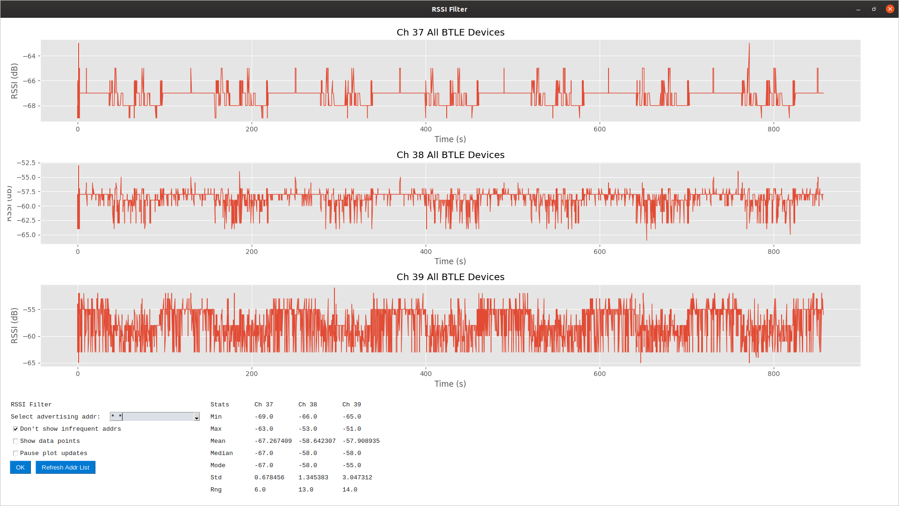
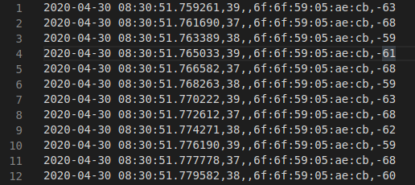
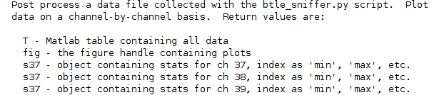
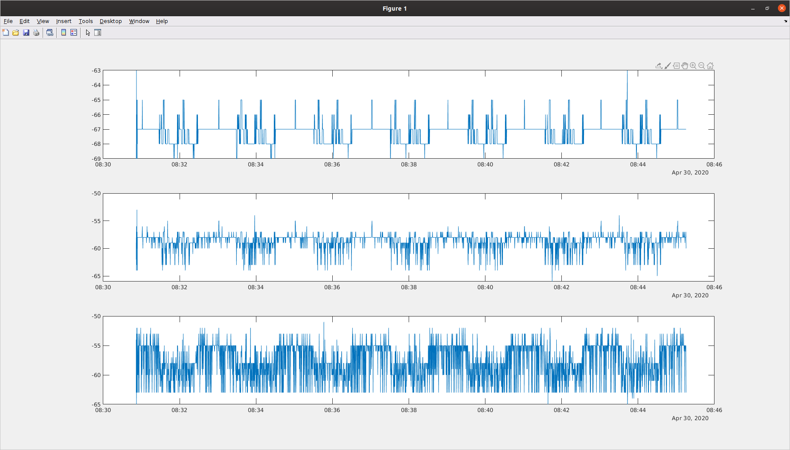
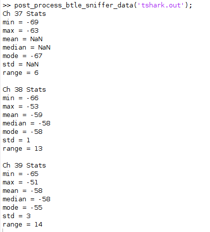

# btle_sniffer
This program requires a RaspPi 4 and a nRF52-DK with installed Bluetooth LE Sniffer ([see Nordic Semi documentation](https://infocenter.nordicsemi.com/index.jsp?topic=%2Fug_sniffer_ble%2FUG%2Fsniffer_ble%2Fintro.html)) firmware to capture and visualize live Bluetooth LE RSSI data.  The image for use on the RaspPi 4 is available from the download link below.  

[RaspPi 4 Ubuntu 18.04 BTLE Sniffer Image](https://drive.google.com/open?id=1eDnt5EfSa-9hmARvvnyXr8WYlHLQDVVJ)

Follow the steps [here](https://www.raspberrypi.org/documentation/installation/installing-images/) to write the image to a bootable SD card.  The static ip address is set to 192.168.152.62 and requires a hard-wired connection to the same LAN that the controlling PC is connected to.

The RaspPi 4 4GB model can be purchased [here](https://www.digikey.com/product-detail/en/raspberry-pi/RASPBERRY-PI-4B-4GB/1690-RASPBERRYPI4B-4GB-ND/10258781).

The nRF52-DK can be purchased [here](https://www.digikey.com/products/en?keywords=nrf52-dk)

The btle_sniffer.py program generates three plots showing the measured RSSI on each of the available Bluetooth LE advertising channels (37, 38, 39).  Additionally, the stats for each channel are shown.  All data is saved in an output file in the same folder as the script as "tshark.out".  In order to run the program, a Linux installation with ssh client, wireshark/tshark, python3, pysimplegui, and matplotlib is required.  For convenience, the following OVA (Open Virtualization Framework) Ubuntu 18.04 VM can be downloaded and used.  It is fully configured with this software and the packages required to run it.

[Ubuntu 18.04 OVA File](https://drive.google.com/file/d/1dWmI-uXqkVM4jhfaz4iX1YwmndrMgIVz/view?usp=sharing)

[Ubuntu 18.04 OVA Readme](https://drive.google.com/open?id=1KTFkCMhauD021Ow03gZeThJPVKwmc4OWUg1Dok6Tf40)

The OVA file can be imported into VirtualBox and then run. In order to update the btle_sniffer repo on the VM to the latest run "git fetch --all" in the btle_sniffer folder from a terminal window.  This OVA image is preconfigured to work with this program and is set up for the nRF52-DK to both program it and use it; follow the instructions within the HOWTO file on the VM desktop to program the sniffer firmware on the nRF52-DK.  Everything else is already configured per the Nordic Semi guide.

The program is executed on the computer running Linux, which connects to the RaspPi 4 and the BTLE sniffer using commands piped over ssh.  The BTLE sniffer from Nordic Semi does not work with tshark (only wireshark), so a capture is initiated to a local file on the RaspPi 4 that is the streamed to the local Linux computer and consumed by the btle_sniffer program.  The GUI is rendered using a TkAgg backend for the Matplotlib and PySimpleGUI libbraries.

The user interface is shown below.

## Usage

The Combo Box for the advertising address allows the user to filter the display on a specific Bluetooth MAC address.  The list of addresses can be updated using the "Refresh Addr List" button.  Selecting '\* \*' results in all data being displayed.  To make any changes take effect clock the OK button.

The output file format is:

Timestamp, Channel, Src Addr, Adv Addr, RSSI

## Matlab Script
An additional Matlab script has been provided for reading in and processing the data in the output file.  The script creates a plot for each channel's RSSI and then calculates and prints the statistics for each dataset.  The script usage is shown below:

